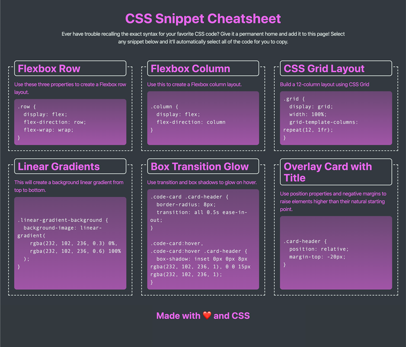
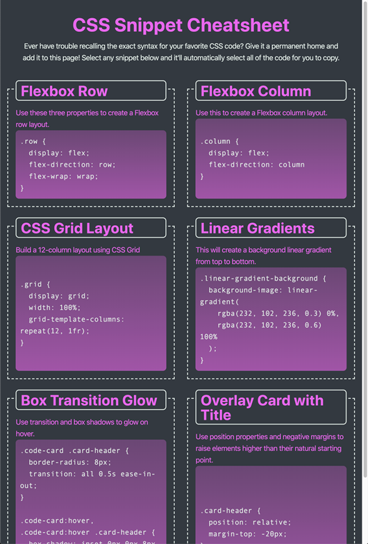
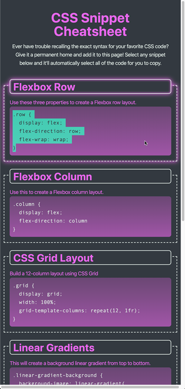

# Module 02 Mini-Project: CSS Snippet Cheat Sheet

## Your Task
The objective of this mini project was to build a webpage that will hold a collection of CSS snippets. 

## Use Story
* As a user, I can view a collection of labeled CSS snippets in a responsive grid.
* As a user, I can easily identify these CSS snippets by their headings.
* As a user, I can highlight a code snippet by clicking on it.
* As a user, I can view my application on a mobile device as well as a desktop.

### Acceptance Criteria
* Must use semantic HTML elements and proper indentation.
* Use CSS variables to maintain clean and reusable values for a color scheme.
* Use flexbox and media queries to create a responsive grid layout.
* Each CSS snippet should have a card-like layout with the CSS syntax wrapped in an [HTML pre element](https://developer.mozilla.org/en-US/docs/Web/HTML/Element/pre).
* Each CSS snippet can easily be highlighted for copying on click using the [CSS user-select property](https://developer.mozilla.org/en-US/docs/Web/CSS/user-select).
* Must incorporate a background color using a [CSS linear-gradient function](https://developer.mozilla.org/en-US/docs/Web/CSS/linear-gradient).
* Must incorporate a bit of animation using the [CSS transition property](https://developer.mozilla.org/en-US/docs/Web/CSS/transition).
* You and your group can decide which CSS styles and colors you will use to design the application, but the app needs to be a responsive. Use the following images to gain an understanding of how the app should look at different screen sizes, from a layout perspective:
* At size 992px and above, the app should resemble the following image:  
    
 

* At size 768px and above, the app should resemble the following image:  
    

* On mobile devices, anything under 768px, the app should resemble the following image:  
    

## Grading Requirements
Nil

## What I Learned
Being the second week we expanded on HTML and went more in-depth in CSS.
  

## What Problems Did we Solve?
I created a responsive landing page that incorporated flex boxes, pseudo coding, CSS variables using HTML and CSS. Also a created a professional README file from scratch. 
  
As this was only week number two and just starting out in coding with no prior background I found it difficult and chalenging.

# Installation

N/A

# Usage
To use and view this challenge please use this the following link to access the deployed website: "https://benarmstrong81.github.io/Ben-Armstrong-Activity-One-Mini-Project/" 

The deployed webpage includes a functioning navigation bar, which will take you to my GitHub and also Portfolio that was completed in a challenge.
The following image shows the web application's appearance:

# Credits
With special thanks to the UniSA Full Stack Web Development Class.

# License

Please refer to the LICENSE in the repo.# Ben-Armstrong-Activity-One-Mini-Project
